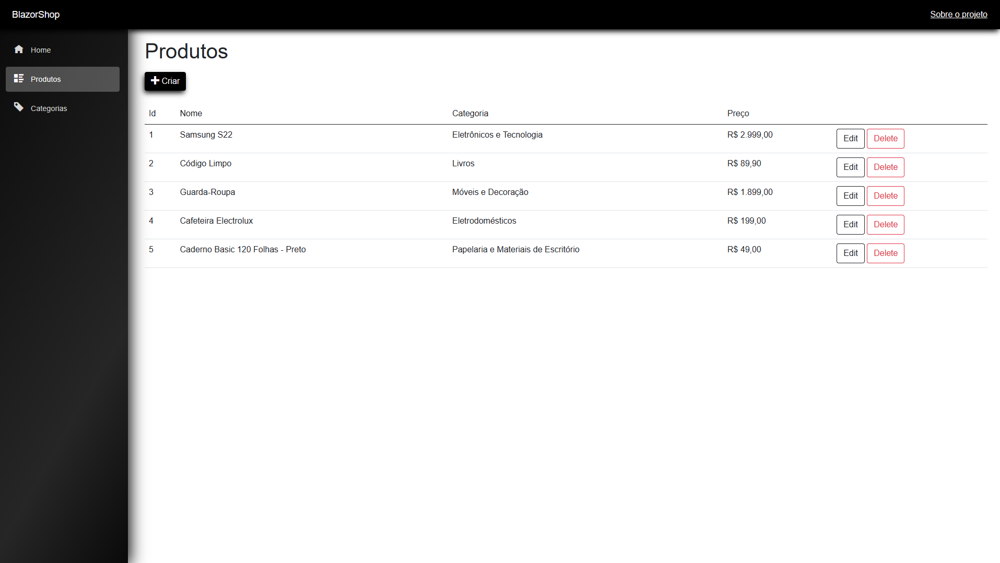
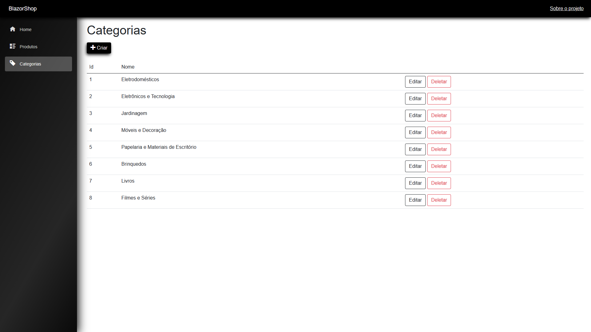

# 🛍️ BlazorShop

- O projeto BlazorShop tem como base o curso [2821](https://balta.io/cursos/fundamentos-do-blazor-server) da plataforma [Balta](https://balta.io/), onde foi desenvolvido um CRUD para apresentar conceitos básicos do framework Blazor.

- Além do projeto desenvolvido durante o curso, onde é desenvolvido a parte CRUD de produtos, para ficar  um projeto mais completo, desenvolvi a parte de CRUD de categorias, além de fazer algumas modificações visuais no projeto.

- Blazor Server é uma parte do framework onde a lógica do aplicativo sera processada no servidor e as interfaces serão geradas pelo lado do usuário utilizando o SignalR para atualizações em tempo real. Assim, Blazor Server acaba sendo uma ótima opção para criar páginas interativas e reaproveitar os conhecimentos adquiridos com C# e .NET

## 🔎 Funcionalidades

- Possibilidade de listar, criar, editar e deletar produtos e categorias de produtos, sendo a persistência dos dados realizada utilizando um banco de dados Sqlite.

## 💻 Tecnologias utilizadas

- C# / .NET
- Blazor Server
- Entity Framework
- Sqlite
- HTML / CSS / Bootstrap
- GIT

## 🖼️ Imagens do Projeto em execução

